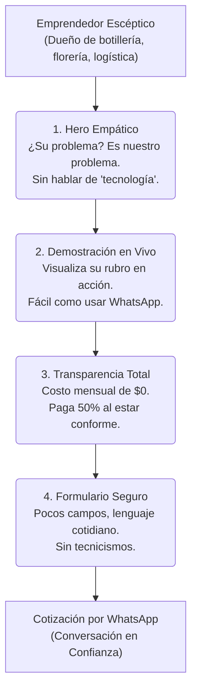

# Plan de Mejoras CRO & Usabilidad Empática (Siempre el Cliente Primero)
**Proyecto:** DevStax.cl – Showcase de Sitios Web para el Mercado Chileno  
**Objetivo:** Adaptar toda la experiencia de la landing page y las demos de negocio para conectar profundamente con el emprendedor chileno no técnico, bajando la desconfianza tecnológica y destacando los retornos reales: ventas, orden, y ahorro de tiempo.

---

## 🗺️ Mapa del Flujo de Conversión sin Fricción

El siguiente diagrama ilustra la transición psicológica del cliente desde la desconfianza inicial hasta la cotización final por WhatsApp:

---

## 📋 Dimensiones y Acciones Específicas de Mejora

### 1. Simplificación del Lenguaje (Fuera Tecnicismos)
*   **Dolor:** El usuario teme sentirse ignorante frente a palabras como "código limpio", "SEO", "hosting" o "base de datos".
*   **Acción de Mejora:** Realizar un barrido en todas las descripciones de los planes y las demos para cambiar tecnicismos por beneficios comerciales:
    *   **En vez de "SEO local georreferenciado":** *"Aparecer en el mapa de tu comuna cuando busquen lo que vendes"*.
    *   **En vez de "Hosting gratuito":** *"Sin arriendos mensuales por internet ($0 pesos mensuales de mantenimiento)"*.
    *   **En vez de "E-commerce autogestionado":** *"Tú mismo subes tus fotos y precios desde el celular, tan fácil como enviar un WhatsApp"*.

### 2. Acompañamiento y Mitigación de Riesgos (Confianza y Seguridad)
*   **Dolor:** Miedo a pagar y no recibir lo prometido, o a que el sitio web falle y no saber qué hacer.
*   **Acción de Mejora:**
    *   **Garantía de Satisfacción 100%:** Añadir explícitamente en la sección de precios: *"No pagas el saldo hasta que veas tu página funcionando y estés 100% conforme"*.
    *   **Acompañamiento Post-Entrega:** Destacar que la entrega incluye un video explicativo grabado a la medida y soporte por WhatsApp para cualquier duda o cambio de horario.

### 3. Representación de Rubros Reales de Chile
*   **Dolor:** *"Mi negocio es una botillería/florería/pesquera, esto de las páginas web es solo para oficinas corporativas."*
*   **Acción de Mejora:** 
    *   Incluir ejemplos de estos rubros específicos dentro del showcase de demos y en los testimonios.
    *   Adaptar las propuestas premium para que mencionen explícitamente cómo solucionan el desorden de un local de comida rápida o de logística local.

### 4. Automatización del Formulario y Reset (Alpine.js)
*   **Dolor:** Formularios largos con campos que piden información difícil de conseguir en el momento (ej: RUT de la empresa o URLs de redes sociales).
*   **Acción de Mejora:**
    *   Mantener el formulario pidiendo solo **Nombre**, **Qué vendes** y **WhatsApp**.
    *   Asegurar que el envío sea directo y amigable mediante un botón con el logo oficial de WhatsApp en verde.

---

## 🛠️ Cronograma de Ejecución "Quick-Wins"

| Prioridad | Tarea Específica | Impacto CRO | Esfuerzo |
| :--- | :--- | :--- | :--- |
| **Alta** | Reemplazar tecnicismos en la tabla de planes y FAQs | Reducción de Fricción Cognitiva | Bajo |
| **Alta** | Incorporar Garantía de Satisfacción y Soporte visible | Incremento de Confianza | Bajo |
| **Media** | Ajustar descripciones de las demos con rubros chilenos tradicionales | Relevancia y Empatía | Medio |
| **Media** | Pulir micro-animaciones del botón de WhatsApp flotante | Dirección de Atención | Bajo |
