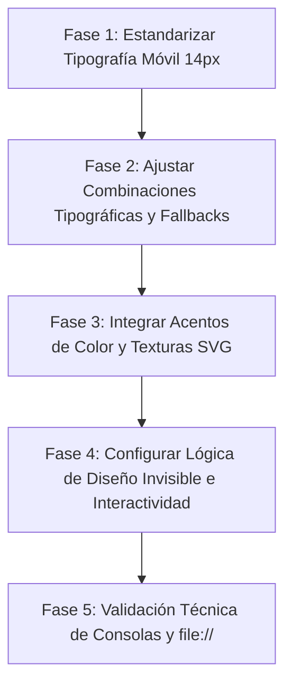

# Mejoras para el Frontend v2 - Estándar Premium y Legibilidad Chilena

Este documento detalla las sugerencias de diseño finales, las observaciones técnicas del **Red Team** y un **Plan de Acción** detallado para el showcase del sitio de promoción y sus demos interactivas.

---

## 1. Auditoría de Legibilidad en Móviles (Foco en el Tamaño Mínimo de 14px)

### 1.1. Diagnóstico de la Auditoría Técnica
Mediante una simulación automatizada con Puppeteer (Chrome emulando un dispositivo móvil con un ancho de viewport de **375px**), se analizó el tamaño de fuente computado real de todos los textos del proyecto. 

Se detectaron múltiples fallas en el cumplimiento del límite mínimo de legibilidad de **14px** en todas las páginas:

*   **Página de Inicio Principal (`index.html`) — 29 Infracciones:** Principalmente causadas por el uso de clases Tailwind con tamaños arbitrarios diminutos como `text-[10px]` o `text-[9px]` (para etiquetas, insignias y subtítulos de testimonios), así como el escalamiento de precios usando estilos en línea con porcentajes (`font-size: 80%` en "neto + IVA", lo que resulta en **11.2px**).
*   **Demo Psicóloga (`demo-psicologa`) — 43 Infracciones:** El proyecto usa la clase estándar `text-xs` (12px) sin overrides responsivos para dispositivos móviles en todas sus secciones principales (acreditación, testimonios, descripciones de procesos y navegación del pie de página).
*   **Demo Café Valparaíso (`demo-cafe-valparaiso`) — 17 Infracciones:** Elementos de menú, etiquetas de ingredientes ("Vegano", "Especialidad") y disclaimers en el pie de página con font-size en línea de `0.85rem` (13.6px), `0.8rem` (12.8px) and `0.7rem` (11.2px).
*   **Demo Salón Belleza (`demo-salon-belleza`) — 22 Infracciones:** Botones de acción rápida ("RESERVAR") definidos con `0.75rem` (12px), duraciones de servicio en `12.8px`, y etiquetas de antes/después en `12px`.
*   **Demo Artesanías (`demo-artesanias`) — 33 Infracciones:** Etiquetas de origen ("MELIPILLA", "CHILOÉ") con un tamaño de `0.55rem` (**8.8px**), y descripciones del catálogo con `13.6px`.
*   **Demo Contabilidad (`demo-contabilidad`) — 12 Infracciones:** Textos secundarios del calculador de planes ("neto + IVA / mes") renderizando a `13.12px` y disclaimers legales a `12px`.

### 1.2. Solución Técnica Propuesta (Estandarización)
Para aplicar de forma universal el tamaño mínimo de **14px** en dispositivos móviles sin romper las composiciones de escritorio, debemos inyectar las siguientes reglas de CSS responsivo en los bloques de estilos (`<style>`) de cada página:

```css
/* Correcciones de legibilidad en móviles (Viewport <= 768px) */
@media (max-width: 768px) {
  /* Forzar un mínimo de 14px en clases de tamaño arbitrario de Tailwind */
  [class*="text-["]:not([class*="md:text-["]) {
    font-size: 14px !important;
    line-height: 1.45 !important;
  }
  
  /* Sobrescribir tamaños pequeños estándar de Tailwind (text-xs) */
  .text-xs {
    font-size: 14px !important;
    line-height: 1.45 !important;
  }
  
  /* Corregir elementos con porcentajes y escalas de rem bajas */
  span[style*="font-size"], 
  p[style*="font-size"], 
  div[style*="font-size"],
  .tag, 
  .cover-badge,
  .service-duration, 
  .filter-btn-qty,
  .product-origin {
    font-size: 14px !important;
    line-height: 1.45 !important;
  }
}
```

---

## 2. Sugerencias Tipográficas Premium e Integración Offline

Para evitar la apariencia genérica que suelen tener los sitios web generados automáticamente, se implementará una dirección tipográfica más sofisticada. A su vez, para garantizar la compatibilidad offline (protocolo `file://`), se definirán fuentes del sistema como respaldo inmediato para mitigar el Cambio Acumulativo del Diseño (CLS).

1.  **Landing Page Principal (Showcase de Servicios):**
    *   *Tipografía:* **Cormorant Garamond** (Títulos elegantes de alto contraste) + **IBM Plex Sans** (Cuerpo de texto legible, menos común que Inter).
    *   *Declaración offline:* `font-family: 'Cormorant Garamond', Georgia, 'Times New Roman', serif;` y `font-family: 'IBM Plex Sans', system-ui, -apple-system, sans-serif;`
2.  **Demo Psicóloga (Ps. Clara Altieri):**
    *   *Tipografía:* **Spectral** (Transmite serenidad y profesionalidad clínica) + **IBM Plex Sans** (Cuerpo limpio).
    *   *Declaración offline:* `font-family: 'Spectral', Georgia, serif;`
3.  **Demo Café Valparaíso (Café La Ruta):**
    *   *Tipografía:* **Outfit** (Títulos modernos) + **Poppins** (Cuerpo con buena lectura).
    *   *Declaración offline:* `font-family: 'Outfit', 'Segoe UI', Tahoma, sans-serif;`
4.  **Demo Salón Belleza (Studio Chic):**
    *   *Tipografía:* **Outfit** (Moderna y fina) + **Didot** o **Bodoni** (Estilo clásico de alta costura francesa para títulos especiales).
    *   *Declaración offline:* `font-family: Didot, 'Bodoni MT', 'Times New Roman', serif;`
5.  **Demo Artesanías del Sur:**
    *   *Tipografía:* Una combinación cálida y terrosa: **Cormorant Garamond** para títulos principales, y **IBM Plex Sans** para detalles.
6.  **Demo Contabilidad (ContaDigital):**
    *   *Tipografía:* **Inter** (Estructura sobria) + **Montserrat** en subtítulos para un contraste corporativo riguroso.

---

## 3. Esquemas de Color con Acentos Premium

Evitaremos el uso de colores saturados planos y colores SaaS predecibles, favoreciendo los siguientes esquemas con identidad regional:

*   **Landing Page:** Base Dracula Dark con acentos en **Verde Esmeralda Brillante** (`#50FA7B`) para botones interactivos en estado hover.
*   **Demo Psicóloga:** Combinar Sage/Sand con acentos de **Terracota Suave** (`#E2725B`) en llamadas a la acción, transmitiendo calidez humana y contención.
*   **Demo Café:** Fondo crema y madera combinado con un **Verde Oliva Profundo** (`#6B8E23`) en los bordes y estados de selección.
*   **Demo Salón:** Monocromo de lujo (negro/blanco/oro) enriquecido con acentos de **Vino Tinto Profundo** (`#800020`) en los botones y marcos divisorios.
*   **Demo Artesanías:** Colores orgánicos de materias primas: **Cobre Oxidado** (`#B87333`) e **Índigo Natural** (`#4B0082`) en etiquetas.
*   **Demo Contabilidad:** Sustituir el típico azul corporativo por un **Verde Esmeralda Profesional** (`#046307`) y **Azul Navy Profundo** (`#0B2545`) que proyectan solidez tributaria y crecimiento.

---

## 4. Animaciones, Texturas e Interactividad (Diseño Invisible)

Siguiendo el principio de que **"el mejor diseño es aquel donde la herramienta desaparece y solo queda el beneficio"**, la interactividad se centrará en eliminar fricciones y hacer los flujos imperceptibles pero encantadores:

*   **Carga Contextual y Menú del Café:** El menú de *Café La Ruta* se reordenará dinámicamente según la hora del dispositivo del usuario (desayunos por la mañana, almuerzos al mediodía y café de especialidad por la tarde), haciendo desaparecer las secciones irrelevantes de inmediato.
*   **Asignación de Estilistas en el Salón:** Al seleccionar un servicio de alta peluquería, el sistema asignará en el backend al estilista ideal y mostrará sus horas disponibles, quitándole al usuario la tarea de elegir profesional a menos que lo pida explícitamente.
*   **Tarificación Automática de Despacho (Artesanías):** Utilización de geolocalización ligera para pre-completar la comuna y calcular la tarifa de despacho de Starken o Chilexpress sin que el usuario digite su dirección hasta el último paso.
*   **Reseteo Total de Modales (Alpine.js):** Para mantener la privacidad y limpieza, al cerrar cualquier modal de cotización o reserva (en las Demos 1, 2, 3, 5 y Checkout de 4), se gatilla automáticamente la función de reset, limpiando las variables en memoria.
*   **Texturas Sutiles:** Uso de texturas en SVG de bajo peso (papel de acuarela para la psicóloga al 5% de opacidad, grano de café para el café, polvo de oro sutil para el salón) integradas como backgrounds CSS repetidos para dar tridimensionalidad táctil offline.

---

## 5. Plan de Acción Detallado para la Implementación

Este plan de acción se ejecutará de forma incremental y no destructiva, asegurando que las pruebas de consolas sigan resultando exitosas.



### Fase 1: Estandarización de Tipografía Móvil
*   **Acción 1.1:** Añadir el bloque de CSS responsivo con overrides `!important` en el `<head>` de `index.html` para unificar clases Tailwind arbitrarias y porcentajes.
*   **Acción 1.2:** Copiar y adaptar este bloque de estilos en los archivos `index.html` de cada una de las 8 carpetas de demostración.
*   **Acción 1.3:** Reemplazar inline font-sizes inferiores al 85% por clases CSS administradas en las vistas de móvil.

### Fase 2: Configuración de Tipografías y Fallbacks de Respaldo
*   **Acción 2.1:** Importar Cormorant Garamond, Spectral e IBM Plex Sans en los encabezados.
*   **Acción 2.2:** Reconfigurar la propiedad `font-family` en los estilos globales de cada demo para incluir la stack de respaldo local (Georgia, system-ui, etc.) a fin de mantener el balance estético offline.

### Fase 3: Integración de Paletas de Colores y Texturas SVG
*   **Acción 3.1:** Actualizar los colores de acento en el CSS (terracota, oliva, vino tinto, esmeralda) en reemplazo de los colores genéricos.
*   **Acción 3.2:** Inyectar los patrones de textura SVG de peso ultra-liviano codificados en Base64 en las reglas CSS de background de las secciones principales.

### Fase 4: Implementación de la Lógica de "Diseño Invisible"
*   **Acción 4.1:** Programar el código Alpine.js de priorización horaria en la Demo del Café y la geolocalización en la Demo de Artesanías.
*   **Acción 4.2:** Asegurar que todos los modales de contacto utilicen `x-effect="if (!bookingModal) resetForm()"` para garantizar limpieza total.
*   **Acción 4.3:** Posicionar siempre el canal de atención "Presencial" como primera opción por defecto en todos los formularios interactivos de reservas.

### Fase 5: Validación y Cierre de QA
*   **Acción 5.1:** Ejecutar el script `node check_consoles.js` para certificar la ausencia de errores o peticiones fallidas de red locales.
*   **Acción 5.2:** Ejecutar la suite de pruebas responsivas para garantizar que ningún elemento tenga un tamaño inferior a 14px en pantallas de 375px.
